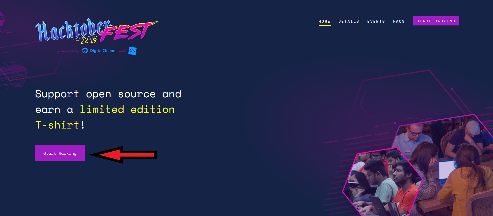
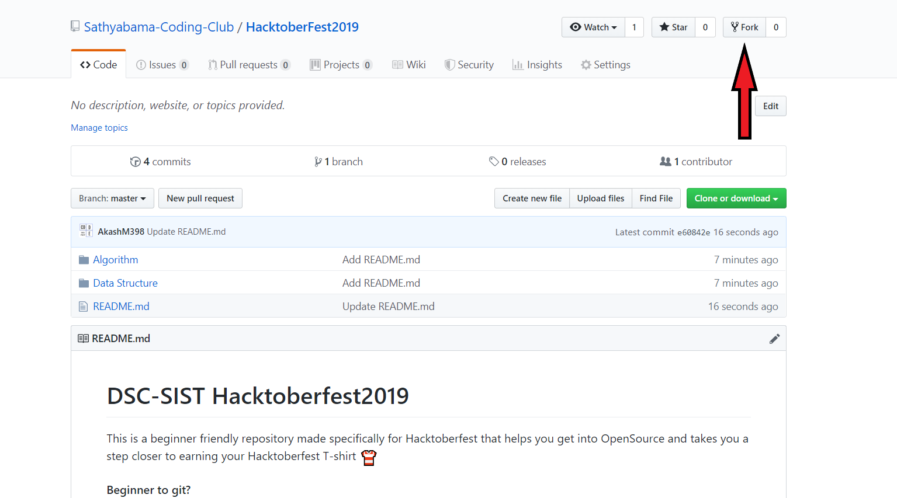

# DSC-SIST Hacktoberfest 2019

This is a beginner friendly repository made specifically for Hacktoberfest that helps you get into OpenSource and takes you a step closer to earning your Hacktoberfest T-shirt 👕

<p align="center">

</p>

#### Beginner to git?
##### Refer to <a href="https://www.digitalocean.com/community/tutorials/how-to-use-git-a-reference-guide" target="blank">  https://www.digitalocean.com/community/tutorials/how-to-use-git-a-reference-guide </a>.


# Instructions :

```diff
- Contribute only to Data Structure+Algorithm Directory
```

### 1. Register yourself for Hacktoberfest 2019
###### Link to register: https://hacktoberfest.digitalocean.com/



### 2. Star and Fork this Repository
###### You can star ⭐ and fork 🍽️ this repository on GitHub by navigating at the top of this repository.



### 3. Clone the Repository

###### To make your own local copy of the repository you would like to contribute to, let’s first open up a terminal window.

###### We’ll use the `git clone`  command along with the URL that points to your fork of the repository.

###### This URL will be similar to the URL above, except now it will end with `.git.` In the example above, the URL will look like this:
https://github.com/Sathyabama-Coding-Club/HacktoberFest2019.git

###### You can alternatively copy the URL by using the green “Clone or download” button from your repository page that you just forked from the original repository page. Once you click the button, you’ll be able to copy the URL by clicking the binder button next to the URL:


###### Once we have the URL, we’re ready to clone the repository. To do this, we’ll combine the git clone command with the repository URL from the command line in a terminal window:
git clone https://github.com/Sathyabama-Coding-Club/HacktoberFest2019.git

### 4. Create a New Branch

###### To create your branch, from your terminal window, change your directory so that you are working in the directory of the repository. Be sure to use the actual name of the repository (i.e. Hacktoberfest2019) to change into that directory.

#####   ` cd HacktoberFest2019`

###### Now, we’ll create our new branch with the git branch command. Make sure you name it descriptively so that others working on the project understand what you are working on.

##### `git branch new-branch`

###### Now that our new branch is created, we can switch to make sure that we are working on that branch by using the git checkout command:

##### ` git checkout new-branch `

###### Once you enter the git `checkout` command, you will receive the following output:

######  `Output:` 
#####  `Switched to branch 'new-branch' `

 
###### At this point, you can now modify existing files or add new files to the project on your own branch.

###### Make sure you have read the contributing.md before you start contributing such that you make remarkable and easily acceptable PRs.

#### Now Make Changes Locally.

###### Once you have modified existing files or added new files to the project, you can add them to your local repository, which you can do with the git add command. Let’s add the -A flag to add all changes that we have made:

##### ` git add -A ` or ` git add . `

###### Next, we’ll want to record the changes that we made to the repository with the git commit command.

###### The commit message is an important aspect of your code contribution; it helps the other contributors fully understand the change you have made, why you made it, and how significant it is. Additionally, commit messages provide a historical record of the changes for the project at large, helping future contributors along the way.Thus, you must ensure that you write a meaningful commit message. If in a confusion, refer to the good contribution guidelines included in the ##### ` contributing.md `

###### If you have a very short message, you can record that with the -m flag and the message in quotes:

###### ` Example: ` 
##### ` git commit -m "Updated Readme.md" `

###### At this point you can use the git push command to push the changes to the current branch of your forked repository:
###### ` Example:`
##### ` git push --set-upstream origin new-branch `

### 5. Update Local Repository

###### While working on a project alongside other contributors, it is important for you to keep your local repository up-to-date with the project as you don’t want to make a pull request for code that will cause conflicts. To keep your local copy of the code base updated, you’ll need to sync changes.

###### We’ll first go over configuring a remote for the fork, then syncing the fork.

### 6. Configure a Remote for the Fork

###### Next, you’ll have to specify a new remote upstream repository for us to sync with the fork. This will be the original repository that you forked from. you’ll have to do this with the git remote add command.

##### ` git remote add upstream https://github.com/ `

###### In this example, // upstream // is the shortname we have supplied for the remote repository since in terms of Git, “upstream” refers to the repository that you cloned from. If you want to add a remote pointer to the repository of a collaborator, you may want to provide that collaborator’s username or a shortened nickname for the shortname.

### 7. Sync the Fork

###### Once you have configured a remote that references the upstream and original repository on GitHub, you are ready to sync your fork of the repository to keep it up-to-date.
###### To sync your fork, from the directory of your local repository in a terminal window, you’ll have to use the // git fetch // command to fetch the branches along with their respective commits from the upstream repository. Since you used the shortname “upstream” to refer to the upstream repository, you’ll have to pass that to the command:

##### ` git fetch upstream `

###### Switch to the local master branch of our repository:

##### ` git checkout master `

###### Now merge any changes that were made in the original repository’s master branch, that you will access through your local upstream/master branch, with your local master branch:

##### ` git merge upstream/master `

### 8. Create Pull Request

###### At this point, you are ready to make a pull request to the original repository.

###### Now navigate to your forked repository, and press the “New pull request” button on your left-hand side of the page.

## Hurray!!! You just got closer to completing your hacktoberfest challenge. 😃

## Happy?? Star ⭐ this Repo. 🤩

## Check your Hacktoberfest Contribution status at:
<a href="https://hacktoberfest.digitalocean.com/profile" target="blank">https://hacktoberfest.digitalocean.com/profile</a>

## For Support:

### Reach us:
#### Instagram - @dsc_sist
#### Email - dsc.sathyabama@gmail.com
